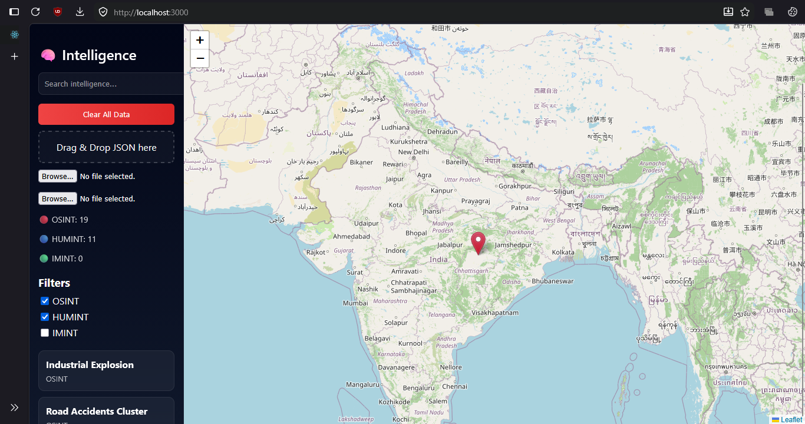
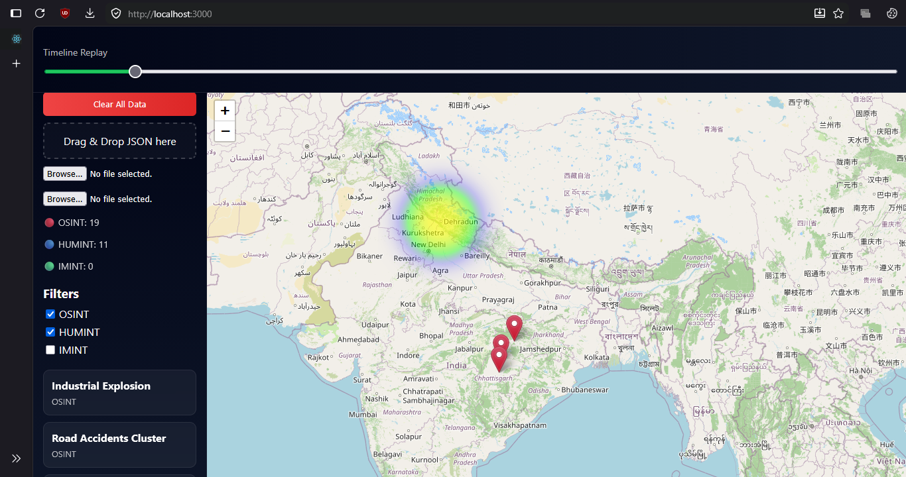

# fusion-intelligence-dashboard# 🧠 Fusion Intelligence Dashboard

A real-time intelligence monitoring system that aggregates, analyzes, and visualizes multi-source data (OSINT, HUMINT, IMINT) on an interactive map with alerts, clustering, and translation support.

---

## 🚀 Features

* 📡 Real-time intelligence data fetching
* 🗺️ Interactive map visualization (Leaflet)
* 🔍 Smart filtering (OSINT, HUMINT, IMINT)
* 📊 Timeline-based data playback
* 🔔 Alert system with sound notifications
* 🌍 Automatic geolocation (OpenCage API)
* 🌐 Multi-language translation to English
* 📂 Drag & Drop JSON upload
* 🖼️ Image upload & preview
* 🔥 Data clustering (fusion intelligence)

---

## 🧠 Tech Stack

### Frontend

* React.js
* Leaflet.js
* Custom CSS

### Backend

* Node.js
* Express.js

### Database

* MongoDB

### APIs Used

* OpenCage Geocoding API
* Google Translate API (unofficial endpoint)
* GNews API (OSINT data)

---

## 📁 Project Structure

fusion-intelligence-dashboard/
│
├── backend/
│   ├── server.js
│   ├── uploads/
│   ├── package.json
│
├── frontend/
│   ├── src/
│   ├── public/
│   ├── package.json
│
├── screenshots/
│
└── README.md

---

## ⚙️ Installation & Setup

### 1️⃣ Clone Repository

git clone https://github.com/your-username/fusion-intelligence-dashboard.git
cd fusion-intelligence-dashboard

---

### 2️⃣ Backend Setup

cd backend
npm install
node server.js

---

### 3️⃣ Frontend Setup

cd frontend
npm install
npm start

---

## 🔑 Environment Setup

Update your API key in `server.js`:

const API_KEY = "YOUR_OPENCAGE_API_KEY";

---

## 📸 Screenshots

### 🖥️ Dashboard View

### 📍 Hover Popup

### 🚨 Alert System

### ⏳ Timeline Control

### 🔥 Clustering View

### 📂 Drag & Drop Upload

### 🌐 Translation Feature

---

## 🎯 Key Highlights

* Real-time intelligence fusion system
* Multi-source data integration
* Advanced clustering & visualization
* Interactive UI with alerts & timeline
* Translation + geolocation support

---

## 👨‍💻 Author

**Sreeram**

---

## 📌 Future Enhancements

* WebSocket real-time updates
* AI-based threat detection
* AWS S3 image storage
* Advanced analytics dashboard

---

## ⭐ Support

If you like this project, give it a ⭐ on GitHub!
